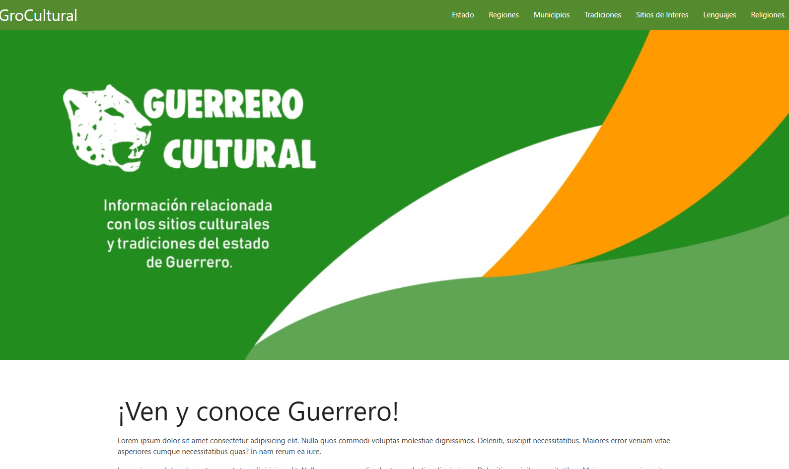

# 🌿 groCultural

¡Bienvenido a **groCultural**! 🇲🇽✨

Un proyecto enfocado en documentar, preservar y difundir la riqueza cultural, geográfica y biológica de la región (principalmente del Estado de Guerrero).

## 🚀 Despliegue (Demo)

Puedes visitar y probar la aplicación en producción aquí:
🔗 **[groCultural en Railway](https://grocultural-backend-production.up.railway.app/)**

## 💡 Sobre el Proyecto

**groCultural** es una aplicación/API desarrollada en **Laravel 10** que sirve como un catálogo y gestor integral de los diferentes aspectos culturales. Entre sus características principales destacan:

- 🗺️ **Municipios y Regiones:** Información detallada sobre la división política y atributos geográficos.
- 🐾 **Flora y Fauna:** Catálogo de la biodiversidad silvestre.
- 🥳 **Tradiciones y Creencias:** Registro de las costumbres locales y religiones prevalentes en cada municipio.
- 🗣️ **Lenguajes:** Documentación de la diversidad lingüística y lenguas originarias.
- 📍 **Sitios de Interés:** Puntos turísticos, culturales y arqueológicos.

---

## 📸 Capturas de Pantalla

---

## 🛠️ Cómo ejecutar de forma local

Para poder correr este proyecto en tu propia máquina de manera local, asegúrate de tener **PHP 8.1+**, **Composer** y **Node.js/NPM** instalados. Además, necesitas un servidor para la base de datos (Ej. XAMPP, WAMP, o Docker).

### Pasos a seguir:

1. **Clona el repositorio** (si aplica) o abre la carpeta del proyecto.
   `ash
   git clone git@github.com:AlinaSM/groCultural.git
   cd groCultural
   `

2. **Instala las dependencias de PHP y Frontend**
   `ash
   composer install
   npm install && npm run dev
   `

3. **Configura el entorno**
   - Asegúrate de tener un archivo .env válido. Si no lo tienes, puedes crearlo copiando el de ejemplo:
   `ash
   cp .env.example .env
   `
   - Abre el archivo .env y ajusta las credenciales de tu conexión a base de datos (por ejemplo, DB_DATABASE=grocultural, DB_USERNAME=root, etc.).

4. **Genera la Application Key** (Si es la primera vez que configuras el .env)
   `ash
   php artisan key:generate
   `

5. **Aplica las Migraciones de la Base de Datos**
   `ash
   php artisan migrate --seed
   `
   *(El flag --seed insertará información inicial o de prueba, si tienes configurados tus Seeders en DatabaseSeeder.php).*

6. **Inicia el servidor de desarrollo local**
   `ash
   php artisan serve
   `
   🚀 Por defecto, el proyecto estará disponible en [http://localhost:8000](http://localhost:8000).

